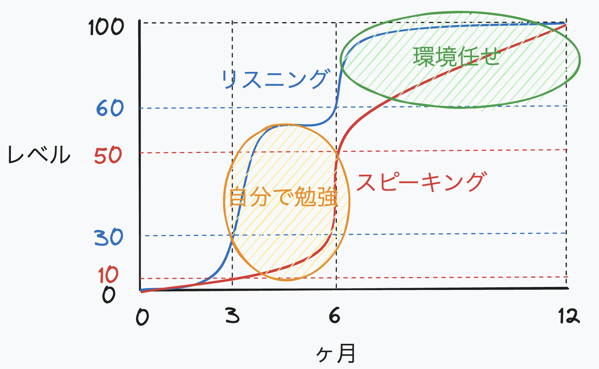

## Introduction

"I want to work in a global environment!" -- Many engineers think this but can't take the first step because they lack confidence in their English. I was one of them. I hadn't studied English since university entrance exams. My reading and writing were passable thanks to residual exam prep knowledge, but **my speaking and listening were essentially non-existent**. In this state, I joined a company where English is the common language. My team included members from Vietnam, Taiwan, the United States, and other countries -- everyone casually chatting in English. Even non-native speakers were speaking fluently, while I sat there in silence. I honestly panicked, thinking "I'm completely out of my league."

**This article covers the study methods I tried over one year (May 2024 -- May 2025) to reach the point where I could conduct 100% of my work in English.** This is purely what worked for me and may not work for everyone. But I hope it helps engineers who, like my past self, are struggling with English learning.

## Target Audience

- Engineers interested in working in an English environment
- Engineers already working in English who want to improve their skills

## The English Learning Journey

### Prologue: Complete Defeat in My First English Meeting

It was around May 2024. In my first meeting conducted in English, I could barely understand 40% of what was being said. When the meeting ended, I was just sitting there confused, not even sure what the discussion had been about. And when I wanted to say something, the words simply wouldn't come out. I was wearing two hats -- needing to ramp up technically while also studying English. As for which to prioritize, **I instinctively raised the priority of English learning and started studying**.

### Chapter 1: Learning How to Learn

"Alright, let's study English!" I was motivated, but then -- how should I actually study? My weaknesses were obvious: I needed to focus on "speaking" and "listening."

I already knew from experience that traditional textbook studying -- sitting at a desk solving problems -- wouldn't cut it. That approach works for writing and reading but does almost nothing for speaking and listening. So **I ruled out test-prep approaches like TOEIC and decided to focus entirely on practical learning**.

With a rough sense of direction, I decided to first learn about "how to study English." I picked up [Zero-Start English Study Methods for IT Engineers](https://bookplus.nikkei.com/atcl/catalog/13/213170/) by Tsuyoshi Ushio. There's also a [YouTube video](https://youtu.be/1eWpoy_DR-w?si=YUKCVvdTlT8YC4Cv) with specific methods. After seeking advice from fluent English speakers at work and weighing my options, **I concluded that "shadowing" would suit me best**.

However, the book recommended shadowing with English CDs, which honestly didn't motivate me. The reason was simple: I just needed English for engineering work -- everyday conversation was secondary. So **I was picky about the shadowing material. Two criteria: it had to be about engineering, and each video had to be under 10 minutes**.

After scouring YouTube for videos that fit, I found THE channel: [ByteByteGo](https://www.youtube.com/@ByteByteGo). ByteByteGo explains system design concepts in about 10 minutes with clear visuals. The content and length were exactly what I needed.

### Chapter 2: Shadowing -- The First Month

With ByteByteGo as the ideal material, I finally had an environment where "I might actually stick with this." All that was left was to do it. Here's the method:

1. Pick a video
2. Listening (1 hour/day)
   - Play the video passively
   - Focus on sounds, intonation, and rhythm -- understanding meaning is optional
   - Listen as if you're the one speaking
3. Shadowing (1 hour/day)
   - Speak along with the video
   - Start with a script (I used [Language Reactor](https://www.languagereactor.com/) to export transcripts)
   - Do this after listening practice
   - Aim to eventually shadow by audio alone

I started shadowing enthusiastically.

The result? I quit after one month. Yes, my vocabulary and feel for English rhythm improved. I was certain this approach would work if I kept it up. But I couldn't sustain it.

Why did it only last a month? On commuting days, I'd listen during my commute and shadow after work. On remote days, I'd do both after work. Listening became routine easily, but shadowing was the problem. **After burning all my mental energy at work, doing something as concentration-intensive as shadowing was too high a bar for someone as lazy as me.** So I kept up the listening but replaced shadowing with something else.

### Chapter 3: NativeCamp for External Motivation

**The biggest reason shadowing didn't stick was the lack of external motivation.** When "skipping doesn't inconvenience anyone," I inevitably go easy on myself. So I decided to deliberately create an environment where slacking off would be harder. Through a company benefit, I had access to [NativeCamp](https://nativecamp.net/), so I gave it a try. NativeCamp is an online English conversation service where each lesson is 20--30 minutes of 1-on-1 conversation with a tutor. You can choose any topic, and the tutors are very kind -- they'll gently correct unnatural English and suggest more natural phrasing. This setup made it harder to skip, and it was useful for "ensuring time spent on English."

However, this also lasted only one to two months. The reason was simple: **there were almost no tutors who could discuss engineering topics in depth.** NativeCamp is great for people looking to improve daily conversation or business English. But since my goal was "learning engineer-specific English for work," there was an inevitable mismatch. After quitting NativeCamp, I went back to just doing ByteByteGo listening.

### Chapter 4: Forced Mission -- "International Conference"

While I was back to a listening-focused routine (around October 2024), an unexpected "forced mission" dropped in: **presenting at an international conference in the Czech Republic**. This conference was unrelated to work -- a completely personal challenge. But the presentation slot was 20--30 minutes. My previous record for continuously speaking in English was maybe 10--15 minutes, so this felt like a massive wall.

Preparing for this presentation clearly improved my speaking ability. The biggest factor was **writing the script myself using only vocabulary I already knew, without relying on auto-generation or translation**. Like shadowing, scripts written by others don't stick in your brain easily.

Words you painstakingly craft yourself are harder to forget and stick better. It's about **how much load you put on your brain**. More load means more pain, but better retention. Less load means less retention. **The key is keeping that load just below the breaking point. Finding the sweet spot between pushing yourself hard and keeping it sustainable is the secret to effective learning.**

### Chapter 5: Creating Your Own Opportunities to Use English

After the big hurdle of the international conference, I honestly didn't study much for the next six months. The only thing I continued was **ByteByteGo listening** -- the one habit that was easiest to maintain.

Why did I stop studying? First, **studying English after work was just too exhausting.** I'm not the disciplined studier type. Second, having reached a certain level of ability, my thinking shifted: "From here, it's better to increase at-bats (practice) rather than keep doing batting practice (studying)."

So from that point on, I focused on **actively creating opportunities to use English**:

- Presenting in English at internal lightning talks
- Facilitating English meetings
- Day-to-day English communication at work

Through this repetition, I experienced firsthand that **"the actual opportunities to use English" become the greatest learning environment**.

### Epilogue: Take the First Step Before Overthinking

Before I knew it, a year had passed since I started learning English. After all the trial and error, here's where I stand:

- I can understand almost 100% of what's said in meetings
- I can express my opinions in English
- People I meet for the first time say, "Your English is great -- are you really Japanese?"

The chart above shows my progress. The x-axis is months since starting, the y-axis is self-assessed English level (0 = one year ago, 100 = now). This isn't a quantitative metric -- it visualizes the perceived growth associated with each chapter's events (shadowing, NativeCamp, international conference, real-world practice).

Honestly, I didn't expect to reach **a level where I could conduct engineering work entirely in English** in just one year, so this was a pleasant surprise. In the engineering world, primary sources are almost all in English, and being able to quickly consume them is a real competitive advantage. **The combination of "English x Engineer" is still rare in Japan, and I've genuinely felt the differentiation and scarcity value it provides. My career options have expanded not just several times over -- maybe several hundred times.**

People often ask, "Is it worth studying English in the age of AI?" Honestly, I don't know. Sure, some kind of "Babel Fish" tool will probably emerge eventually. But **when** that happens is anyone's guess. That's exactly why **it's better to start studying before overthinking it. In a few years, you can reach a level that's perfectly usable for work.**

For lazy people like my former self who think "I can't sustain the motivation for English learning," **immersing yourself in an English-only environment** is the fastest route. If you've read this far, you already have the **intrinsic motivation** for English learning. Now just layer on **extrinsic motivation**. Personally, the most effective approach is "diving into an English environment." For student engineers, studying abroad is the easiest option. For working engineers in Japan who want to learn English domestically, **joining a company where English is the working language and learning through practice** is the most efficient path.

## Final Thoughts

To summarize, the three most important things about English learning are:

1. **If you're confident in your motivation, shadowing is effective**
   It trains both input and output, rapidly building your foundation.

2. **Combine intrinsic and extrinsic motivation**
   Placing yourself in a "no choice but to do it" environment makes it much harder to give up.

3. **Environment is everything**
   Putting yourself in an environment where you use English yields far greater results than self-study. As the soccer legend Keisuke Honda said, invest in your "environment."

And what even a lazy person like me realized: **in one year, you can reach a level sufficient for work.** Once you can speak English, your career expands beyond your home country to the whole world. You gain faster access to information and a clear edge over other engineers. No matter what technological innovations lie ahead, **the ability to connect directly with the world in your own words** will always be an asset. So please, take that first step before overthinking it.

## Bonus

### Recommended English Study Methods

Here are the methods I tried, ranked by recommendation level:

| Method | Description | Sustainability | Effectiveness | Recommendation |
| --- | --- | --- | --- | --- |
| Immerse in an English environment | Join a company where English is the working language, study abroad, etc. The fastest route. | ★★★★★ | ★★★★★ | ★★★★★ |
| Set device language to English | Switch your phone and PC to English for constant exposure. Can do it right now. | ★★★★★ | ★☆☆☆☆ | ★★★★★ |
| Shadowing | Use ByteByteGo YouTube + Language Reactor to export scripts for pronunciation practice. | ★★☆☆☆ | ★★★★☆ | ★★★★☆ |
| YouTube passive listening | Listen to tech YouTube during commutes/walks. Learn English and technology simultaneously. | ★★★★☆ | ★★★☆☆ | ★★★★☆ |
| NativeCamp | Used via company benefit. Hard to discuss tech topics, but good for conversation practice. | ★★★☆☆ | ★★★☆☆ | ★★★☆☆ |
| Talk to foreigners | Strike up conversations with foreigners you encounter. Fun but low reproducibility. | ★☆☆☆☆ | ★★☆☆☆ | ★★☆☆☆ |
| Watch movies/anime in English | Movies are usually 2 hours (too long). Anime without Japanese voice actors felt wrong. Gave up. | ★★☆☆☆ | ★☆☆☆☆ | ★☆☆☆☆ |

### Resources on Money Forward's English Adoption

There are already published interviews and videos from colleagues -- check them out:

- [YouTube: Money Forward's Global Engineering](https://youtu.be/7YI4SJ2796M)
- [Japan Dev: Money Forward Engineering Global Challenge](https://japan-dev.com/blog/money-forward-engineering-global-challenge-ja)
