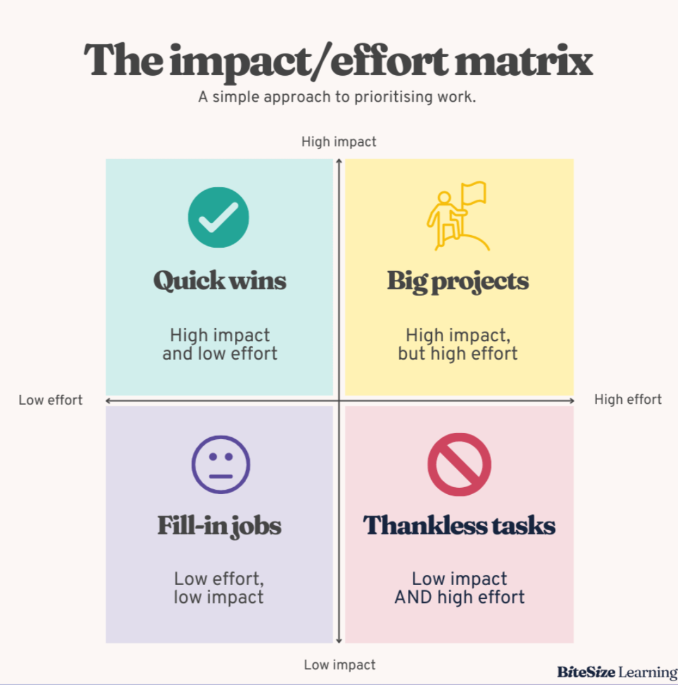
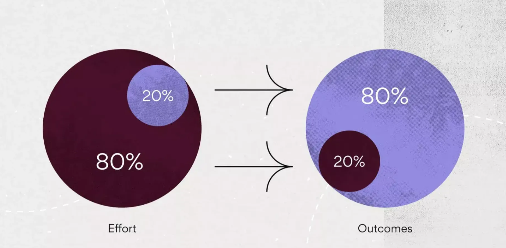
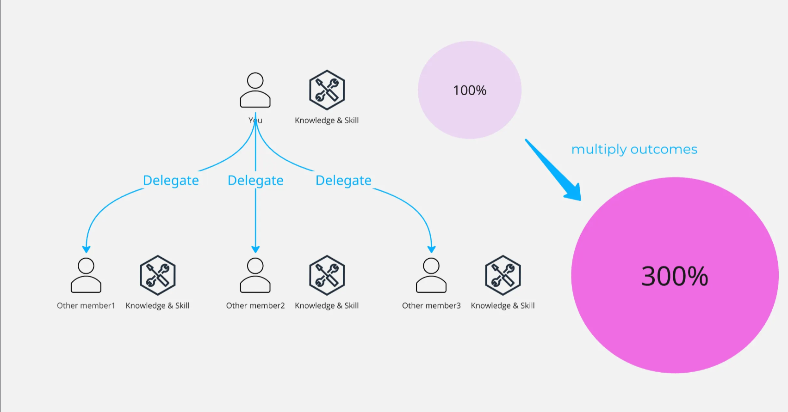

## Introduction

This document explores three critical lessons learned during my first year as a Software Engineer (SRE). Based on both personal experience and research-backed strategies, these insights are designed to support not only engineers but also designers, business professionals. By applying these lessons, early-career professionals can navigate their initial year with confidence, establish a strong foundation for career growth, and maximize their impact within their organizations.

## Focus on High-Impact, Low-Effort Tasks: The Power of Quick Wins

### Understanding Quick Wins

"Quick wins" refer to strategies or actions that can achieve significant results quickly with relatively little effort. This concept is particularly valuable during your first year as it allows you to demonstrate value promptly while building confidence and momentum. Quick wins create visible outcomes that not only advance organizational goals but also establish your credibility early.

(ref. [Impact vs. effort matrix | A 2x2 template for prioritising tasks - BiteSize Learning](https://bitesizelearning.co.uk/resources/impact-vs-effort-matrix))

These early successes serve multiple purposes: they provide visible evidence of your capabilities, boost your professional confidence, and generate positive momentum that can carry forward into more complex initiatives. For example, improving the CI/CD pipeline might be a relatively straightforward task that yields immediate productivity improvements and demonstrates your problem-solving abilities.

### Applying the 80–20 Rule to Task Management

The Pareto Principle, commonly known as the 80–20 rule, complements the "Quick Wins" approach by suggesting that 80% of outcomes typically result from 20% of inputs. In your first year, identifying which activities generate the most significant results and focusing your energy accordingly can dramatically increase your effectiveness.

(ref. [Learn the Pareto Principle (The 80/20 Rule) [2025] • Asana](https://asana.com/resources/pareto-principle-80-20-rule))

By applying this principle, you can focus on the vital few tasks that drive the majority of results rather than dispersing your efforts across numerous less impactful activities. This focused approach not only improves efficiency but also ensures maximum return on your invested time and energy.

## Ask Many Questions: Leveraging Your First Year Learning Opportunity

Your first year represents a unique window of opportunity for learning and relationship building. During this period, asking thoughtful questions is not only expected but can significantly accelerate your professional development and integration into the team.

### The First Year as a Golden Period

The initial year in a new position is comparable to having temporary invincibility - similar to the star power-up in Mario games. During this time, your colleagues and supervisors typically expect and encourage questions as part of your onboarding and development process. This period offers a unique opportunity to establish your reputation as someone who is engaged, curious, and committed to understanding the organization's operations and culture.

(ref. [スーパーマリオブラザーズ ワンダー : アイテムでパワーアップ | Nintendo Switch | 任天堂](https://www.nintendo.com/jp/switch/aqmxa/item/index.html))

Taking full advantage of this golden period requires recognizing its temporary nature and maximizing the learning opportunities it presents. Questions asked during this time are generally viewed as signs of engagement rather than indicators of incompetence, making it the ideal moment to address fundamental aspects of your role and the organization - although, of course, asking questions should always be seen as a positive behavior, not limited to just the first year.

### Building Relationships Through Thoughtful Inquiry

Asking questions serves as a powerful relationship-building tool. By approaching colleagues with thoughtful inquiries, you demonstrate respect for their expertise while creating opportunities for meaningful interaction. This approach helps establish you as approachable and collaborative, key traits that contribute to positive workplace relationships.

When you ask questions thoughtfully, you signal your interest in understanding others' perspectives and experiences. This open-minded attitude creates stronger professional connections and helps you build a supportive network within your organization. Additionally, it creates the impression that you're easy to work with - a reputation that can prove invaluable throughout your career.

### Accept Feedback as a Valuable Gift with Open Arms

Feedback represents one of the most important types of information you can seek during your first year. Viewing feedback as a gift rather than criticism creates a mindset conducive to growth and improvement. Research indicates that employees who actively engage in giving and receiving feedback tend to be more involved in the workplace overall.

The benefits of feedback are multifaceted: it inspires personal and professional growth by offering new perspectives on how your behavior impacts others; it provides a sense of purpose by highlighting the significance of your contributions; and it helps build strong relationships through open communication channels. Seeking regular feedback during your first year establishes a pattern of continuous improvement that can serve you throughout your career.

## Enabling Other Members: The Path to Higher-Level Contributions

As you establish yourself in your role, one of the most powerful ways to increase your impact is by transitioning from handling all tasks personally to enabling and developing others. This shift allows you to focus on higher-level contributions while building team capacity.

### Moving Beyond Solo Performance by Delegating

While demonstrating individual capability is important during your early tenure, long-term success often depends on your ability to multiply your impact through others.

#### The Power of Delegation

Delegating tasks and empowering other members can lead to increased efficiency and personal growth within the team or the organization. According to the [How to Delegate Effectively: 9 Tips for Managers](https://online.hbs.edu/blog/post/how-to-delegate-effectively), the effective delegation includes:

- **Know What to Delegate** - Focus on tasks that others can do, freeing you up for higher-impact work (Quick Wins concept can be applied here as well)
- **Play to Your Employees' Strengths and Goals** - Assign tasks that align with their skills and help them grow
- **Define the Desired Outcome** - Clearly communicate what success looks like from the start
- **Provide the Right Resources and Level of Authority** - Equip them with the tools and decision-making power they need
- **Establish a Clear Communication Channel** - Set up a way to check in and address questions without micromanaging
- **Allow for Failure** - Create a safe space for mistakes as part of the learning process
- **Be Patient** - Give time and space for learning and ownership to develop
- **Deliver (and Ask For) Feedback** - Share constructive input and welcome feedback to improve delegation
- **Give Credit Where It's Due** - Acknowledge and celebrate their contributions publicly

### Teaching as a Path to Leadership

Taking the time to teach others is an investment that yields returns at multiple levels. When you share your knowledge and skills, you help colleagues develop new capabilities as well as deepen your own understanding. The act of explaining processes often reveals insights that might otherwise remain unconscious.

Moreover, teaching others demonstrates leadership potential and commitment to organizational success beyond your individual performance. This approach aligns with the concept of feedback as a gift - by providing guidance and instruction, you're offering valuable input that helps others grow professionally. The relationships built through these teaching interactions also strengthen your professional network and establish you as a valuable resource within the organization.

## Conclusion

These three lessons - focusing on quick wins, asking questions during your golden period, and enabling other members - form a powerful framework for maximizing your impact during your first year.

- **Focus on Quick Wins** - Strategically prioritize high-impact, low-effort tasks to quickly demonstrate value and build momentum.
- **Ask Questions During Your Golden Period** - Use your unique newcomer status to ask questions and seek feedback, accelerating learning and building strong relationships.
- **Enable Other Members** - Shift from individual contributions to empowering your team, multiplying your impact, and preparing for higher-level responsibilities.

By implementing these lessons thoughtfully during your first year, I hope you establish patterns of success that can serve you throughout your career.

## References

- [Understanding the Pareto principle (The 80/20 rule)](https://asana.com/resources/pareto-principle-80-20-rule)
- [A Guide for Effective Delegation: Empowering Your Team for Success | Leadership Development and Management Training Resources](https://online.hbs.edu/blog/post/how-to-delegate-effectively)
- [C&T Scene: Feedback is a gift that keeps on giving | It's Your Yale](https://your.yale.edu/work-yale/learn-and-grow/career-development/ct-scene-feedback-gift-keeps-giving)
