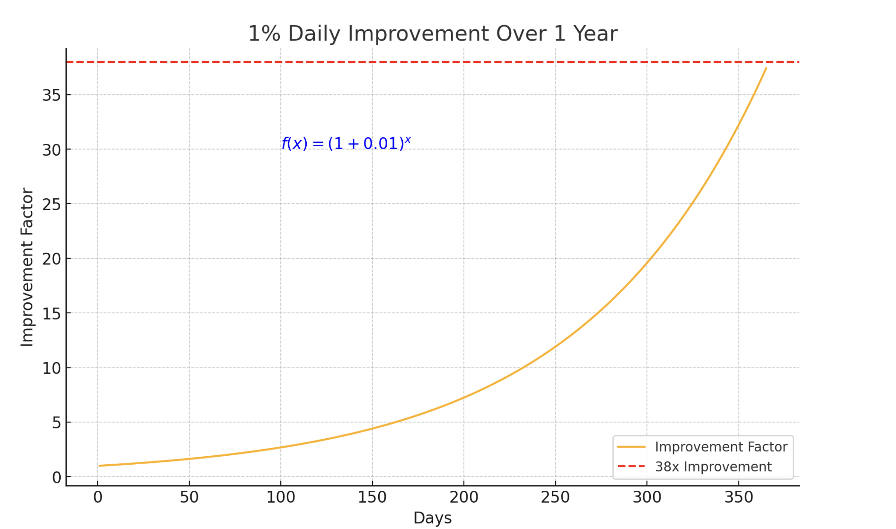
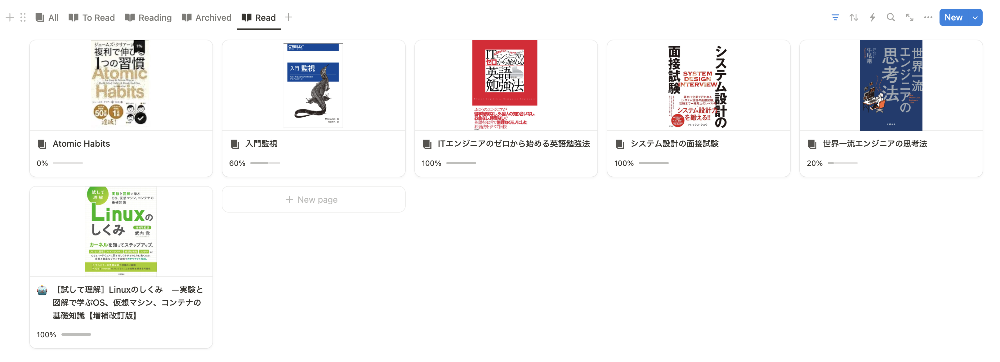
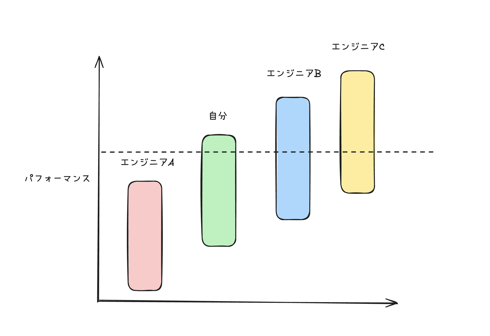

> This post was originally published as part of the [Money Forward Engineers Advent Calendar 2024](https://adventar.org/calendars/9988) on December 6th.

## Introduction

### About Me

Hi there! I'm [88888888_kota](https://twitter.com/88888888_kota), a 2024 new graduate who joined Money Forward as an engineer in April 2024. I currently work as a Site Reliability Engineer (SRE). It's been six months since I joined, and I'd like to reflect on this period.

If you're interested in why I joined, I also wrote a separate post about that.

### Target Audience

- People interested in SRE: [Career Strategy](#career-strategy), [Work Overview](#work-overview)
- First-year engineers looking for advice: [What Worked Well](#what-worked-well), [What I Wish I'd Done](#what-i-wish-id-done), [What I Didn't Need to Do](#what-i-didnt-need-to-do)
- People interested in working in an English environment: [Working in English](#working-in-english)

## Career Strategy

I chose SRE as my first position, which is probably an uncommon path. There were several strategic reasons behind this decision.

### Skill Imbalance

During university, I participated in many internships as a backend engineer. However, I gradually started feeling that backend development alone was becoming repetitive, and I worried that **my growth would plateau** if I continued down that path.

Specifically, by the time I graduated, my skills were heavily skewed toward Go backend development. I was concerned that if I took a backend position, **I'd have very few opportunities to gain infrastructure knowledge in areas like Kubernetes and AWS**. This is especially true at companies with thousands of employees, where backend and infrastructure responsibilities are clearly separated.

**To perform at senior or staff-level and above, infrastructure experience is essential -- and I felt this was the perfect time to gain it.**

### Less Competition

Infrastructure-focused positions have less competition compared to backend roles, and **there are many opportunities for junior engineers** in particular.

These reasons didn't strictly require SRE specifically, but among the teams accepting new graduates, the SRE team was the best match for my strategy. So I requested to be placed there, and here I am. I wasn't targeting SRE from the start.

## Work Overview

Here's what I worked on during these six months. This section should be helpful for anyone interested in what SRE work looks like.

### About My Team

My team is primarily responsible for ensuring the availability and reliability of B2B products:

- Money Forward Cloud Accounting
- Money Forward Cloud Tax Filing
- Money Forward Cloud Invoicing

Each of these is built as microservices, so we're responsible for 10+ services in total.

### Kubernetes Custom Controller Development


**Overview**

- Improved credential management for securely accessing AWS resources from on-premise Kubernetes clusters. Specifically, I combined [EKS Pod Identity](https://docs.aws.amazon.com/eks/latest/userguide/pod-identities.html) with [IAM Roles Anywhere](https://docs.aws.amazon.com/rolesanywhere/latest/userguide/introduction.html) to provide secure credential delivery.

**Period**

- May 2024 – August 2024

**Details**

- I handled the entire development solo.
- During the Proof of Concept phase, I built a minimal implementation to verify feasibility. I built the necessary components from scratch using [kubebuilder](https://github.com/kubernetes-sigs/kubebuilder). After team discussions and iterating on the implementation, we deployed to production. At that point, instead of building from scratch, I forked EKS Pod Identity and customized it as needed to improve quality.

**Challenges**

- Reading the source code of [aws-sdk-go-v2](https://github.com/aws/aws-sdk-go-v2) and EKS Pod Identity was difficult.
  - However, most of aws-sdk-go-v2 is auto-generated by [Smithy](https://smithy.io/2.0/index.html), and once you recognize the patterns, it becomes much easier to understand.
  - For EKS Pod Identity, understanding how Kubernetes Admission Controllers work was key to grasping the source code.

**Tech Stack**

- ArgoCD, AWS, Docker, GitHub Actions, Go, Kubernetes, Terraform

**Side Note**

Before my team placement, I had a 1-on-1 with my mentor about what kind of work I wanted to do. They assigned tasks aligned with my career goals:

- Mentor: "What kind of career are you envisioning?"
- Me: "I want to shift from backend toward infrastructure. Specifically, I want to work with Kubernetes and AWS. And I want to go deep on the technical side!"
- Mentor: "Then these tasks might be a good fit."

That's how my very first "job" as a working adult ended up being Kubernetes Custom Controller development.


### On-Premise Kubernetes to EKS Migration


**Overview**

- Participated in a project to migrate a service from on-premise Kubernetes to EKS.

**Period**

- September 2024 – November 2024

**Details**

- As a project member, I handled various tasks.
- Built CI/CD pipelines using GitHub Actions and CircleCI, conducted network testing between dependent microservices, and improved monitoring.

**Challenges**

- Mapping out service dependencies was tough.
  - The architecture diagram had gaps, so I resorted to directly interviewing developers -- a hands-on, somewhat tedious approach.
- This was a cross-border project, and the communication overhead with stakeholders was high.
  - I think this is something you get better at with experience, so I'm optimistic about doing better next time.

**Tech Stack**

- ArgoCD, AWS, CircleCI, Datadog, GitHub Actions, Kubernetes, Ruby, Terraform


### Interrupt Tasks


**Overview**

- In addition to the projects above, we have daily interrupt tasks (PR reviews for our team, processing requests from other teams, etc.).
- These are handled on a rotation basis, with the person on duty prioritizing interrupt tasks.

**Period**

- May 2024 – November 2024

**Details**

- Prioritizing and reactively handling interrupt tasks.

**Challenges**

- All sorts of requests come in, and not being able to answer them immediately made me keenly aware of my lack of experience.
- I got through it by asking team members for help.

**Tech Stack**

- ArgoCD, AWS, CircleCI, Datadog, Docker, GitHub Actions, Go, Kafka, Kubernetes, Linux, MySQL, Ruby, Terraform


## What Worked Well

### Fix Your Mindset First

Above all else, reviewing and correcting your mindset is the first step toward growth. Technical skills can come later. With the right mindset, your growth speed increases dramatically.

Here are some books I'd recommend for mindset improvement:

- [The Thought Patterns of World-Class Engineers](https://www.amazon.co.jp/dp/4163917683) (by Tsuyoshi Ushio)
- [Atomic Habits](https://www.amazon.co.jp/dp/4775942158) (by James Clear)

### Build and Evolve Your Own Best Practices

For situations you frequently encounter at work, prepare your own best practices (routines). This frees up mental resources for what truly matters. And keep improving them daily. **If you improve by just 1% every day for a year, the compound effect is 38x.**

### Deliberately Create Opportunities to Speak English

This is for those working in an English environment who want to improve: **actively step up to the plate**. Volunteer for 1-on-1s, meeting facilitation, and any opportunity to speak.

### Voice Your Opinions

If you have questions, suggestions for improvement, or something feels off about your team or engineering organization, don't hesitate to speak up. Being new gives you a unique perspective that others might miss.

### Become a Productivity Nerd

Invest time in configuring the tools you use daily. Actively adopt useful tools and always keep your antenna up for new ones.

Here are my top 10 productivity-boosting tools:

https://pitch.com/v/10-productivity-tools-for-developers-q49wye

### Read Books

Reading is one of the most cost-effective ways to grow. I aim for at least one book per month.

### Don't Hoard Work

Try not to block work at your end -- Slack replies, PR reviews, etc. Aim for instant responses. If you can't respond right away, at least say "I'll look at this later." Or delegate to someone else.

### Take Regular Breaks

Engineers take far fewer breaks than they realize. We just sit there for hours. Make a habit of getting up at least once an hour -- go to the bathroom, drink water, change your scenery.

## What I Wish I'd Done

### Proactively Request 1-on-1s

To maximize growth opportunities, you should proactively set up 1-on-1s beyond just your mentor. Talk to people in your team and across departments. Use these conversations to get feedback on your work and hear different perspectives on team challenges.

### Understand Your Team and Department Goals

Before diving into tasks, understand your team's and department's goals first. Clarify your role, and focus on work you *should* do (high-value work) rather than work you *want* to do. This leads to higher-quality output.

### Ask "Basic" Questions Quickly

If you can't find the information you need after a few minutes of searching, just ask. Don't wait the full 15 minutes. While waiting for an answer, work on something else.

## What I Didn't Need to Do

### Overestimating Others / Underestimating Yourself

First, a fundamental truth: everyone's performance fluctuates based on their environment and condition. If you only compare yourself to other people's peak performance, you'll feel miserable.

**What matters is consistently delivering high performance.** If you can consistently perform at 80%, you'll produce better output than more talented engineers B and C who are inconsistent.

### Studying Tech Unrelated to Work

Studying technology that isn't directly related to your job is fine as a hobby, but it's not necessary for delivering results at work. **Prioritizing work-relevant technology and skills** is the most effective path to growth.

## Working in English

After six months of working in an English-only environment, I finally feel like I'm getting the hang of it. The first three months were honestly painful -- I could barely listen or speak. But I gradually adapted over time.

As an objective measure, my [PROGOS](https://progos.ai/) score improved from A2 to B1 High. The biggest factor was **consistently putting myself in real situations**. You naturally adapt if you keep using the language.

I'm still experimenting with learning methods and haven't found my personal best approach yet. I plan to share what's worked for me in a future post.

## Goals Going Forward

**Tech**

I'll focus on delivering reliable services while improving developer experience and productivity. Specifically: faster CI/CD, introducing SLI/SLO, improving monitoring, and standardizing configurations where possible. I also want to help spread SRE practices more broadly.

**English**

After six months, I've gotten used to English. But my "combat thinking speed" is still low, so I'll deliberately create more opportunities to use English -- 1-on-1s, meeting facilitation, and more.
